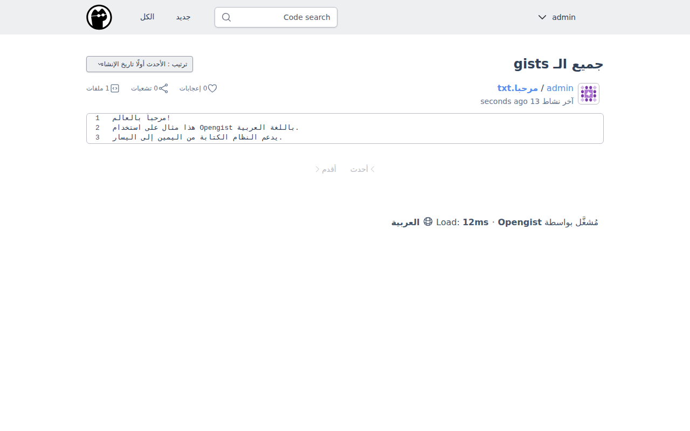
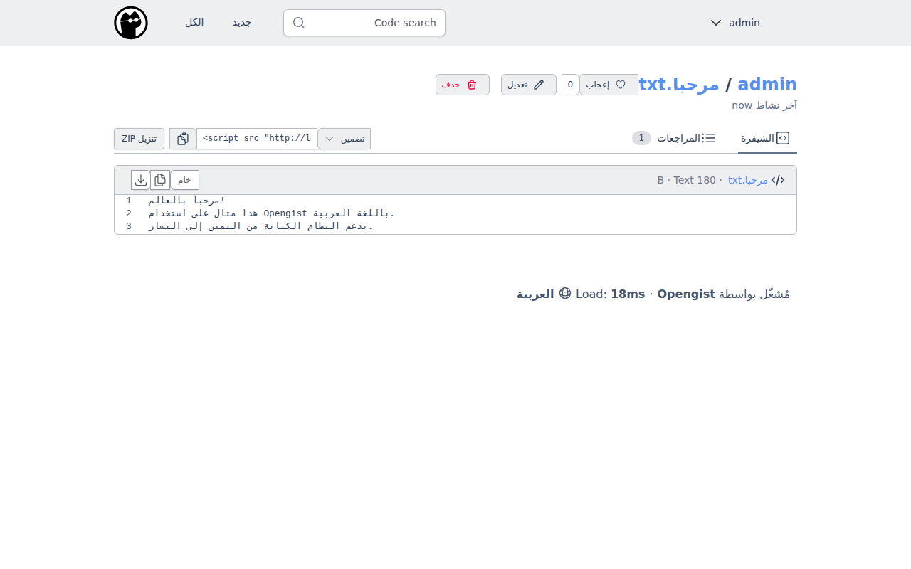
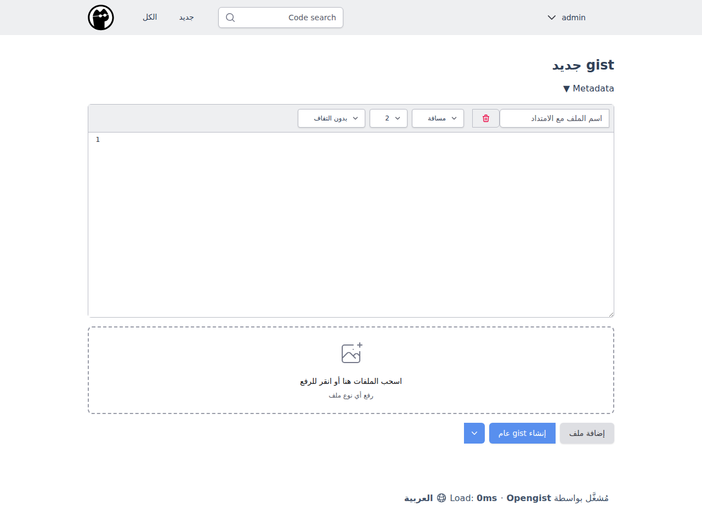
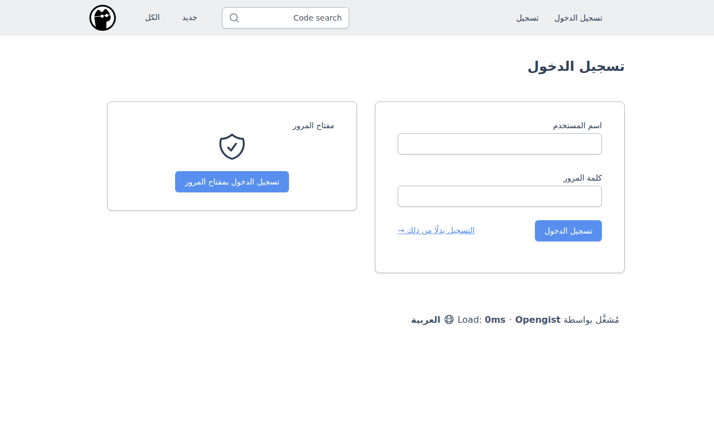
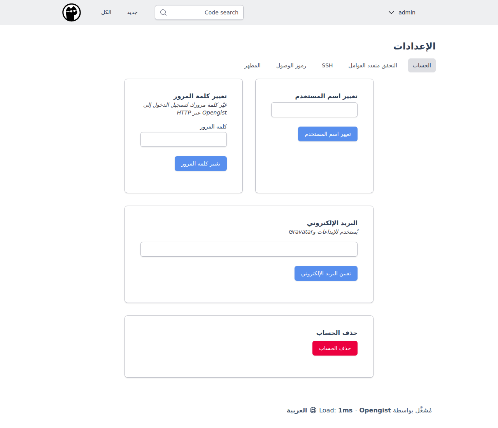

# Arabic (RTL) Language Support

Opengist supports Arabic and other right-to-left (RTL) languages natively. When the Arabic locale (`ar-SA`) is selected, the interface automatically switches to RTL layout with proper font rendering.

## Features

- **Full RTL layout**: The entire interface flips to right-to-left direction when Arabic is selected.
- **Tajawal font**: The Tajawal Arabic typeface is loaded automatically for Arabic locale, providing clear and readable Arabic text.
- **Complete translation**: All UI strings are translated to Modern Standard Arabic (العربية الفصحى).
- **Code block preservation**: Code blocks and editors remain in LTR direction for correct display of code.

## Selecting Arabic Language

You can switch to Arabic in two ways:

1. **Via URL parameter**: Append `?lang=ar-SA` to any page URL (e.g., `https://your-opengist.example.com/all?lang=ar-SA`).
2. **Via language selector**: Click the language selector at the bottom of any page and choose "العربية".

Once selected, the language preference is stored in a cookie and persists across sessions.

## Screenshots

### All Gists (جميع الـ gists)

*The gists listing page with full RTL layout and Arabic translations.*

### Gist View (عرض الـ Gist)

*Individual gist view with Arabic interface and RTL layout. Note that code content remains in LTR direction.*

### Create New Gist (إنشاء gist جديد)

*The gist creation form with Arabic labels and RTL input fields.*

### Login (تسجيل الدخول)

*The login form with Arabic labels in RTL layout.*

### Settings (الإعدادات)

*The settings page with all sections properly translated and laid out in RTL.*

## Font Implementation

For Arabic, Opengist loads the **Tajawal** font from Google Fonts in weights 400 (regular), 500 (medium), and 700 (bold). The font is loaded conditionally — only when an RTL locale is active — to avoid unnecessary overhead for users of LTR languages.

The RTL CSS is applied via the `[dir="rtl"]` attribute set on the `<html>` element. This ensures:
- Proper text alignment (right-to-left)
- Mirrored navigation and layout
- Correct spacing and margin directions
- Preserved LTR direction for code blocks and editors

## Technical Details

The RTL support is implemented across three files:

| File | Purpose |
|------|---------|
| `internal/i18n/locale.go` | `IsRTL()` method that identifies RTL locales |
| `templates/base/base_header.html` | Conditionally sets `dir="rtl"` and loads Tajawal font |
| `public/css/style.css` | RTL-specific CSS rules for layout mirroring |

### Supported RTL Locales

The following locale codes are recognized as RTL:

| Code | Language |
|------|----------|
| `ar-SA` | Arabic (Saudi Arabia) |
| `ar` | Arabic |
| `he` | Hebrew |
| `fa` | Persian (Farsi) |
| `ur` | Urdu |
